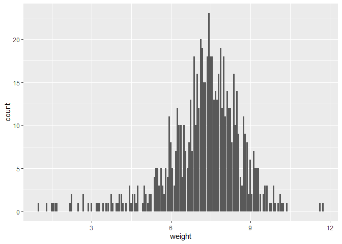
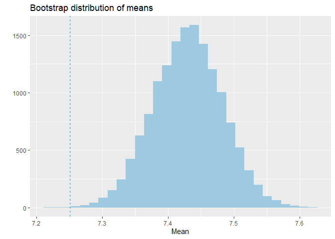
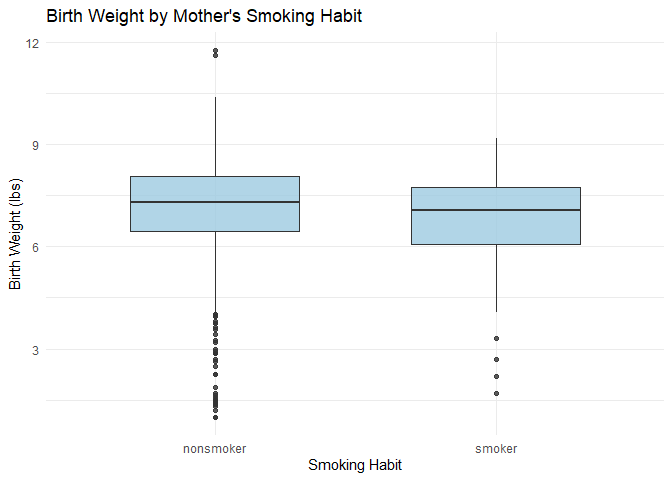

Lab 12 - Smoking during pregnancy
================
Yiwei Tang
2/20/2026

### Load packages and data

``` r
library(tidyverse) 
library(tidymodels)
library(openintro)
data(ncbirths)
```

### Exercise 1

fage, mage, weeks, visits, gained, and weight are numerical variables.
fage, mage, visits, and gained are skewed to the right with some
outliers. weeks and weight are skewed to the left with outliers.

``` r
summary(ncbirths)
```

    ##       fage            mage            mature        weeks             premie   
    ##  Min.   :14.00   Min.   :13   mature mom :133   Min.   :20.00   full term:846  
    ##  1st Qu.:25.00   1st Qu.:22   younger mom:867   1st Qu.:37.00   premie   :152  
    ##  Median :30.00   Median :27                     Median :39.00   NA's     :  2  
    ##  Mean   :30.26   Mean   :27                     Mean   :38.33                  
    ##  3rd Qu.:35.00   3rd Qu.:32                     3rd Qu.:40.00                  
    ##  Max.   :55.00   Max.   :50                     Max.   :45.00                  
    ##  NA's   :171                                    NA's   :2                      
    ##      visits            marital        gained          weight      
    ##  Min.   : 0.0   not married:386   Min.   : 0.00   Min.   : 1.000  
    ##  1st Qu.:10.0   married    :613   1st Qu.:20.00   1st Qu.: 6.380  
    ##  Median :12.0   NA's       :  1   Median :30.00   Median : 7.310  
    ##  Mean   :12.1                     Mean   :30.33   Mean   : 7.101  
    ##  3rd Qu.:15.0                     3rd Qu.:38.00   3rd Qu.: 8.060  
    ##  Max.   :30.0                     Max.   :85.00   Max.   :11.750  
    ##  NA's   :9                        NA's   :27                      
    ##  lowbirthweight    gender          habit          whitemom  
    ##  low    :111    female:503   nonsmoker:873   not white:284  
    ##  not low:889    male  :497   smoker   :126   white    :714  
    ##                              NA's     :  1   NA's     :  2  
    ##                                                             
    ##                                                             
    ##                                                             
    ## 

``` r
ncbirths %>% 
  ggplot(
    aes(
      x = fage,
    )
  ) +
  geom_boxplot() +
  theme_minimal()
```

    ## Warning: Removed 171 rows containing non-finite outside the scale range
    ## (`stat_boxplot()`).

<!-- -->

``` r
ncbirths %>% 
  ggplot(
    aes(
      x = mage,
    )
  ) +
  geom_boxplot() +
  theme_minimal()
```

<!-- -->

``` r
ncbirths %>% 
  ggplot(
    aes(
      x = weeks,
    )
  ) +
  geom_boxplot() +
  theme_minimal()
```

    ## Warning: Removed 2 rows containing non-finite outside the scale range
    ## (`stat_boxplot()`).

<!-- -->

``` r
ncbirths %>% 
  ggplot(
    aes(
      x = visits,
    )
  ) +
  geom_boxplot() +
  theme_minimal()
```

    ## Warning: Removed 9 rows containing non-finite outside the scale range
    ## (`stat_boxplot()`).

<!-- -->

``` r
ncbirths %>% 
  ggplot(
    aes(
      x = gained,
    )
  ) +
  geom_boxplot() +
  theme_minimal()
```

    ## Warning: Removed 27 rows containing non-finite outside the scale range
    ## (`stat_boxplot()`).

<!-- -->

``` r
ncbirths %>% 
  ggplot(
    aes(
      x = weight,
    )
  ) +
  geom_boxplot() +
  theme_minimal()
```

<!-- -->

### Exercise 2

The mean weights of infants of White mothers in the sample is 7.25
pound, which is less than the average.

``` r
ncbirths_white <- ncbirths %>% 
  filter(whitemom == "white")

mean(ncbirths_white$weight)
```

    ## [1] 7.250462

### Exercise 3

The observations in the sample are independent of each other and the
sample size is reasonably large (n = 1000), and the shape of the
distribution. However, the shape of the distribution is slightly skewed
to the left. Therefore, I don’t think the criteria necessary for
conducting simulaiton-based inference are satisfied.

``` r
ncbirths_white %>% 
  ggplot(
    aes(x = weight)
  ) +
  geom_bar()
```

<!-- -->

### Exercise 4

``` r
set.seed(123)

boot.data <- ncbirths_white %>%
  specify(response = weight) %>% 
  generate(reps = 15000, type = "bootstrap") %>% 
  calculate(stat = "mean")

obs_mean <- mean(ncbirths_white$weight)

boot_mean_center <- mean(boot.data$stat)

null_dist <- boot.data %>%
  mutate(null_stat = stat - boot_mean_center + 7.43)

null_dist %>% 
  ggplot(
    aes(
      x = null_stat)
    ) +
  geom_histogram(fill = "#9ecae1") +
  labs(title = "Bootstrap distribution of means",
       x = "Mean",
       y = "") +
  geom_vline(aes(
    xintercept = obs_mean
  ),
    color = "#3182bd",
    linetype = "dashed")
```

    ## `stat_bin()` using `bins = 30`. Pick better value `binwidth`.

<!-- -->

``` r
p_value <- null_dist %>%
  summarise(p = mean(abs(null_stat - 7.43) >= 
                     abs(obs_mean - 7.43))) %>%
  pull(p)

p_value
```

    ## [1] 0.0006666667

The p-value is less than 0.001, which supports the alternative
hypothesis that the baby weight in the sample is significantly lower
than that of the population.

### Exercise 5

``` r
ncbirths %>%
  filter(!is.na(habit),
         !is.na(weight)) %>%
  ggplot(aes(
    x = habit, 
    y = weight)) +
  geom_boxplot(fill = "#9ecae1",
               alpha = 0.8,
               width = 0.6) +
  labs(title = "Birth Weight by Mother's Smoking Habit",
    x = "Smoking Habit",
    y = "Birth Weight (lbs)"
  ) +
  theme_minimal()
```

<!-- -->

The boxplots show that birth weights for babies of smoking mothers tend
to be lower than those of non-smoking mothers. The median weight for
smokers is visibly lower, although the spreads of the two groups are
fairly similar and the distributions overlap considerably. Both groups
show slight skewness and some potential outliers. While there appears to
be a difference in center, formal statistical testing is needed to
determine whether this difference is statistically significant.

### Exercise 6

``` r
ncbirths_clean <- ncbirths %>%
  filter(!is.na(habit), !is.na(weight))
```

It is important to remove rows with missing values in either habit or
weight before calculating group summaries because missing values can
distort results. Observations without a smoking status cannot be
assigned to a group, and observations without a birth weight cannot
contribute to the calculation of group means. Removing incomplete cases
ensures that comparisons between groups are based only on valid and
comparable data.

### Exercise 7

``` r
ncbirths_clean %>%
  group_by(habit) %>%
  summarise(mean_weight = mean(weight))
```

    ## # A tibble: 2 × 2
    ##   habit     mean_weight
    ##   <fct>           <dbl>
    ## 1 nonsmoker        7.14
    ## 2 smoker           6.83

``` r
obs_diff <- ncbirths_clean %>%
  group_by(habit) %>%
  summarise(mean_weight = mean(weight)) %>%
  summarise(diff = diff(mean_weight)) %>%
  pull(diff)

obs_diff
```

    ## [1] -0.3155425

The observed difference in mean birth weight between babies born to
non-smoking and smoking mothers is approximately 0.3 pounds. On average,
babies of non-smoking mothers weigh more than those of smoking mothers.

### EXercise 8

Let $\mu_1$ represent the mean birth weight for babies born to
non-smoking mothers, and $\mu_2$ represent the mean birth weight for
babies born to smoking mothers.

**Null Hypothesis:** There is no difference in birth weight between the
two groups. $$
H_0: \mu_1 - \mu_2 = 0
$$

**Alternative Hypothesis:** There is a difference in mean birth weight
between the two groups. $$
H_A: \mu_1 - \mu_2 \neq 0
$$

### Exercise 9

``` r
ttest <- t.test(weight ~ habit, data = ncbirths_clean, alternative = "two.sided")
ttest
```

    ## 
    ##  Welch Two Sample t-test
    ## 
    ## data:  weight by habit
    ## t = 2.359, df = 171.32, p-value = 0.01945
    ## alternative hypothesis: true difference in means between group nonsmoker and group smoker is not equal to 0
    ## 95 percent confidence interval:
    ##  0.05151165 0.57957328
    ## sample estimates:
    ## mean in group nonsmoker    mean in group smoker 
    ##                7.144273                6.828730

I am honestly very confused at this point. I am not sure what I should
be doing for this exercise. And it has taken me way too long to get to
this point. I think it might be a good place for me to stop and spend
the time I have to think more about what bootstrapping is doing and how
that’s different from inferential analysis.
