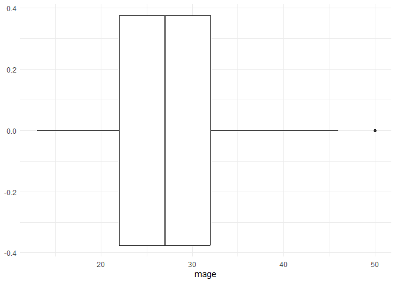
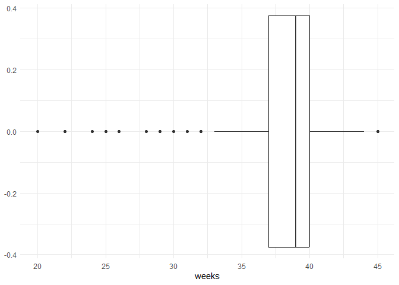
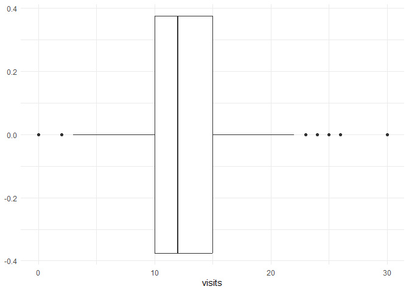
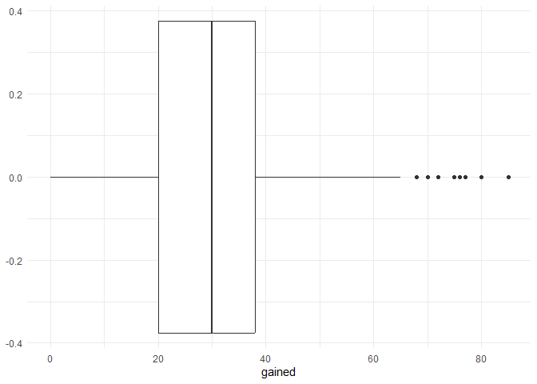

Lab 12 - Smoking during pregnancy
================
Yiwei Tang
2/19/2026

### Load packages and data

``` r
library(tidyverse) 
library(tidymodels)
library(openintro)
data(ncbirths)
```

### Exercise 1

fage, mage, weeks, visits, gained, and weight are numerical variables.
fage, mage, visits, and gained are skewed to the right with some
outliers. weeks and weight are skewed to the left with outliers.

``` r
summary(ncbirths)
```

    ##       fage            mage            mature        weeks             premie   
    ##  Min.   :14.00   Min.   :13   mature mom :133   Min.   :20.00   full term:846  
    ##  1st Qu.:25.00   1st Qu.:22   younger mom:867   1st Qu.:37.00   premie   :152  
    ##  Median :30.00   Median :27                     Median :39.00   NA's     :  2  
    ##  Mean   :30.26   Mean   :27                     Mean   :38.33                  
    ##  3rd Qu.:35.00   3rd Qu.:32                     3rd Qu.:40.00                  
    ##  Max.   :55.00   Max.   :50                     Max.   :45.00                  
    ##  NA's   :171                                    NA's   :2                      
    ##      visits            marital        gained          weight      
    ##  Min.   : 0.0   not married:386   Min.   : 0.00   Min.   : 1.000  
    ##  1st Qu.:10.0   married    :613   1st Qu.:20.00   1st Qu.: 6.380  
    ##  Median :12.0   NA's       :  1   Median :30.00   Median : 7.310  
    ##  Mean   :12.1                     Mean   :30.33   Mean   : 7.101  
    ##  3rd Qu.:15.0                     3rd Qu.:38.00   3rd Qu.: 8.060  
    ##  Max.   :30.0                     Max.   :85.00   Max.   :11.750  
    ##  NA's   :9                        NA's   :27                      
    ##  lowbirthweight    gender          habit          whitemom  
    ##  low    :111    female:503   nonsmoker:873   not white:284  
    ##  not low:889    male  :497   smoker   :126   white    :714  
    ##                              NA's     :  1   NA's     :  2  
    ##                                                             
    ##                                                             
    ##                                                             
    ## 

``` r
ncbirths %>% 
  ggplot(
    aes(
      x = fage,
    )
  ) +
  geom_boxplot() +
  theme_minimal()
```

    ## Warning: Removed 171 rows containing non-finite outside the scale range
    ## (`stat_boxplot()`).

<!-- -->

``` r
ncbirths %>% 
  ggplot(
    aes(
      x = mage,
    )
  ) +
  geom_boxplot() +
  theme_minimal()
```

<!-- -->

``` r
ncbirths %>% 
  ggplot(
    aes(
      x = weeks,
    )
  ) +
  geom_boxplot() +
  theme_minimal()
```

    ## Warning: Removed 2 rows containing non-finite outside the scale range
    ## (`stat_boxplot()`).

<!-- -->

``` r
ncbirths %>% 
  ggplot(
    aes(
      x = visits,
    )
  ) +
  geom_boxplot() +
  theme_minimal()
```

    ## Warning: Removed 9 rows containing non-finite outside the scale range
    ## (`stat_boxplot()`).

<!-- -->

``` r
ncbirths %>% 
  ggplot(
    aes(
      x = gained,
    )
  ) +
  geom_boxplot() +
  theme_minimal()
```

    ## Warning: Removed 27 rows containing non-finite outside the scale range
    ## (`stat_boxplot()`).

<!-- -->

``` r
ncbirths %>% 
  ggplot(
    aes(
      x = weight,
    )
  ) +
  geom_boxplot() +
  theme_minimal()
```

<!-- -->

### Exercise 2

…

Add exercise headings as needed.
